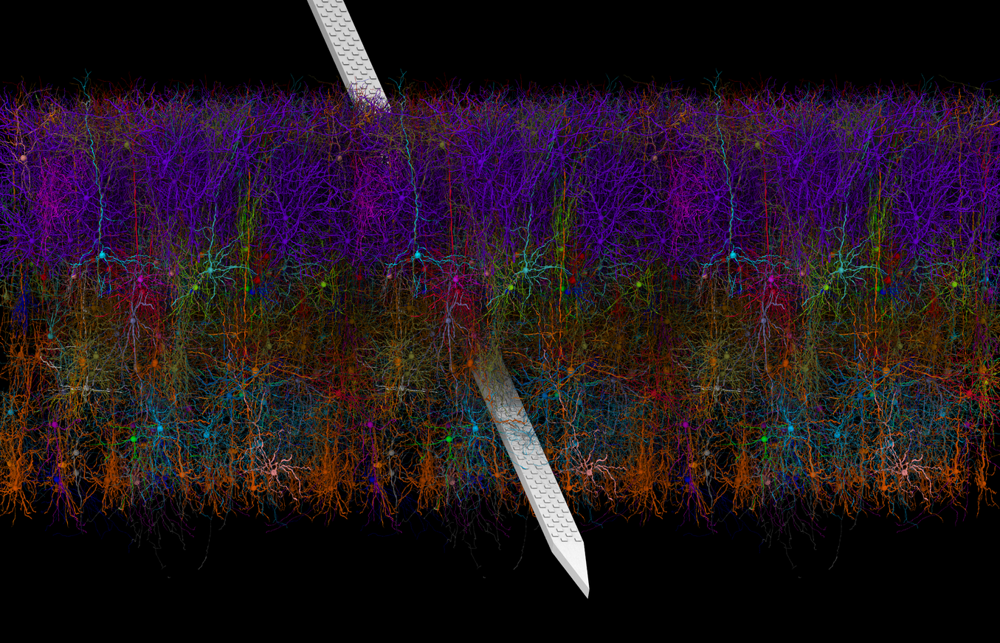

# Biorealistic Modeling with the Brain Modeling Toolkit

In this tutorial we will show how to use the [Brain Modeling Toolkit (BMTK)](https://alleninstitute.github.io/bmtk/) and
[SONATA data format](https://github.com/AllenInstitute/sonata) to build, simulate, and distribute large-scale circuit
models of the brain. We will show how we used these tools to build our own models of the mouse cortex, and how you can
use and expand upon these open-source models in your own work. To access the tutorial please follow the link below:

https://github.com/AllenInstitute/bmtk/blob/develop/docs/tutorial/modeling_tut_2021/Mouse_L4.ipynb

which includes instructions how to run the tutorial and install BMTK on your own machine.

## Further resources

* [More documentation, examples and tutorials of the BMTK](https://alleninstitute.github.io/bmtk/)

* [The SONATA Data Formats](https://github.com/AllenInstitute/sonata)

* [Models of the Mouse Mouse Primary Visual Cortex](https://portal.brain-map.org/explore/models/mv1-all-layers)

* [Model of Layer 4 of the Mouse Primary Visual Cortex](https://portal.brain-map.org/explore/models/l4-mv1)

* [Visual Neural Dynamics (VND) - A tool for visualizing large-scale networks and simulations](http://www.ks.uiuc.edu/Research/vnd/)